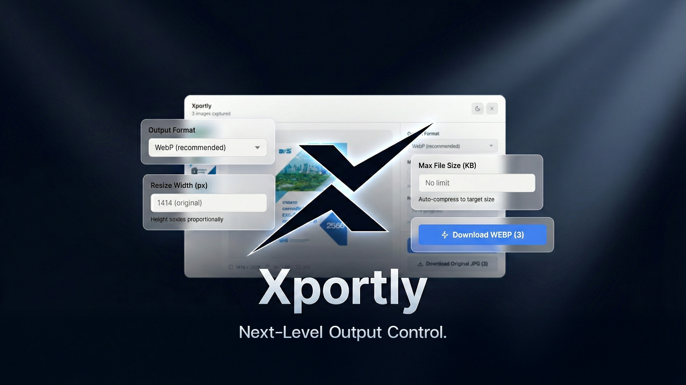

# Xportly



Chrome Extension ที่ช่วยให้คุณ export รูปจาก Canva ได้ดีขึ้น — เลือก format, กำหนดขนาดไฟล์, และ compress อัตโนมัติ ทั้งหมดทำบน client-side ไม่ต้องพึ่ง server

## ✨ Features

- 🎯 ดักจับรูปที่ export จาก Canva อัตโนมัติ (รองรับทั้งรูปเดี่ยวและ ZIP หลายรูป)
- 🚫 Block download จาก Canva แล้วแสดง overlay ให้ optimize ก่อน
- 🔄 แปลง format: WebP, JPEG, PNG
- 📦 กำหนด max file size และ auto-compress
- 📐 Resize รูปได้ตามต้องการ
- 🖼️ รองรับหลายรูปพร้อมกัน พร้อม thumbnail preview
- � Download ทีละรูป หรือ Download All เป็น ZIP
- 🌓 Dark / Light theme
- � Responsive design
- 🔒 ทำงานบน client-side ทั้งหมด ไม่ส่งข้อมูลไปไหน

## 📥 Installation

1. Download หรือ clone โปรเจคนี้
2. เปิด Chrome แล้วไปที่ `chrome://extensions/`
3. เปิด "Developer mode" (มุมขวาบน)
4. คลิก "Load unpacked"
5. เลือก folder `smart-canva-exporter`

## 🚀 Usage

1. ไปที่ [canva.com](https://canva.com) และเปิดงานที่ต้องการ export
2. กด Download ใน Canva ตามปกติ (เลือก PNG หรือ JPG)
3. Extension จะดักจับและแสดง overlay อัตโนมัติ
4. เลือก format และตั้งค่าที่ต้องการ
5. กด "Download" เพื่อ optimize และ download

### Export หลายรูป
- Canva จะ export เป็น ZIP → Extension จะแตกไฟล์และแสดงทุกรูป
- เลือกรูปจาก thumbnail ด้านซ้าย
- กด "Download All" เพื่อ download ทุกรูปเป็น ZIP

## ⚙️ Options

| Option | Description |
|--------|-------------|
| Output Format | WebP (แนะนำ), JPEG, หรือ PNG |
| Max File Size | กำหนดขนาดไฟล์สูงสุด (KB) - จะ compress อัตโนมัติ |
| Resize Width | ปรับความกว้างรูป (ความสูงจะ scale ตาม) |

## � Technical Details

- Manifest V3
- ใช้ Downloads API เพื่อดักจับและ cancel download จาก Canva
- ใช้ Offscreen Document สำหรับ Canvas processing และ ZIP handling
- ใช้ JSZip สำหรับ extract/create ZIP files
- CSS แยกไฟล์ (overlay.css)

## 📁 File Structure

```
smart-canva-exporter/
├── manifest.json       # Extension manifest
├── background.js       # Service worker
├── content.js          # Content script + overlay UI
├── overlay.css         # Overlay styles
├── injected.js         # Page-level script
├── offscreen.html      # Offscreen document
├── offscreen.js        # Image processing + ZIP handling
├── lib/
│   ├── jszip.min.js    # ZIP library
│   └── compressor.js   # Compression utilities
├── popup/              # (Legacy - not used)
└── icons/
    └── (icon files)
```

## ⚠️ Notes

- ใช้งานได้เฉพาะบน canva.com
- รองรับเฉพาะ image export (ไม่รองรับ PDF หรือ video)
- Page reload จะ clear รูปที่ capture ไว้

## 📝 License

MIT
